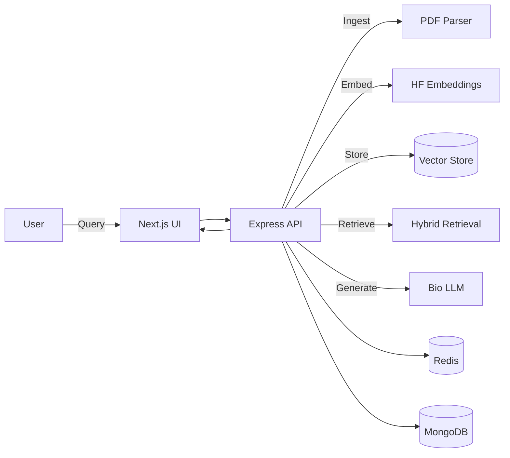

# MediQuery: Jungle Explorer's Medical Q&A Assistant

A jungle-themed, multimodal Retrieval-Augmented Generation (RAG) web application for medical Q&A with PDF ingestion, hybrid retrieval, and cited responses.

## Features
- Jungle-themed UI with accessible, responsive design and dark mode.
- PDF ingestion with text extraction and image placeholders.
- Hybrid retrieval (vector similarity + BM25 keyword).
- Agentic query refinement with LangChain.
- Multimodal response rendering with inline images.
- Evaluation dashboard with metrics and batch testing.
- Rate limiting, sanitization, caching, and logging.

## Tech Stack
- Next.js 14 (App Router) + TypeScript
- Tailwind CSS + shadcn/ui + framer-motion
- Express API (Node.js) with Multer
- LangChain + Hugging Face Transformers (local)
- MongoDB Atlas, Redis
- Docker, docker-compose, GitLab CI

## Local Setup
1. Install dependencies: npm install
2. Create a .env file based on .env.example
3. Run dev servers: npm run dev

API runs on http://localhost:4000 by default. The Next.js app runs on http://localhost:3000.

## Commands
- npm run dev
- npm run test
- npm run test:e2e
- npm run api:dev

## Architecture (Mermaid)

## Data
- Place public medical PDFs in data/README.md for instructions.

## Ethics
This tool is for educational use only and is not medical advice.

## Deployment
- Use Docker or deploy Next.js on Vercel and API on EC2.
- For Docker: docker compose up --build

## Notes
- Replace placeholder assets in public/assets.
- The PDF image extraction is a placeholder and should be upgraded for production.
